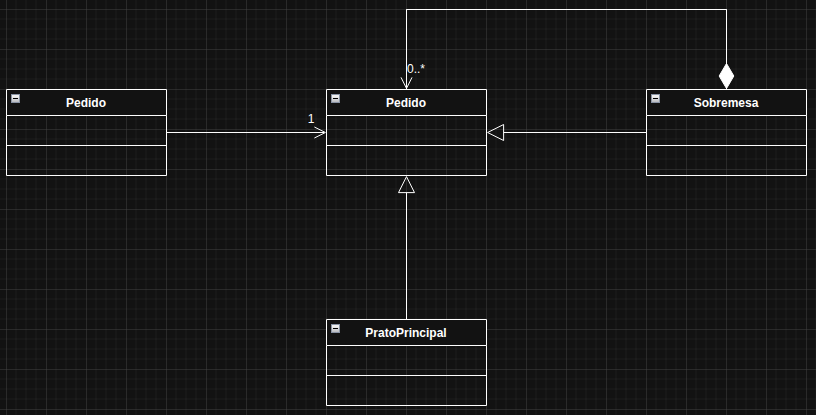

# Composite

O Composite é um padrão de projeto estrutural que permite tratar objetos individuais e grupos de objetos da mesma forma. Resumindo: você cria uma estrutura em forma de árvore, onde um componente pode ser algo simples ou um conjunto de componentes — e ambos são usados do mesmo jeito.

No exemplo usado, foi pensado em ordens de pedido de um restaurante, onde se pede o prato principal e vai se adicionando sobremesas que desejar.

